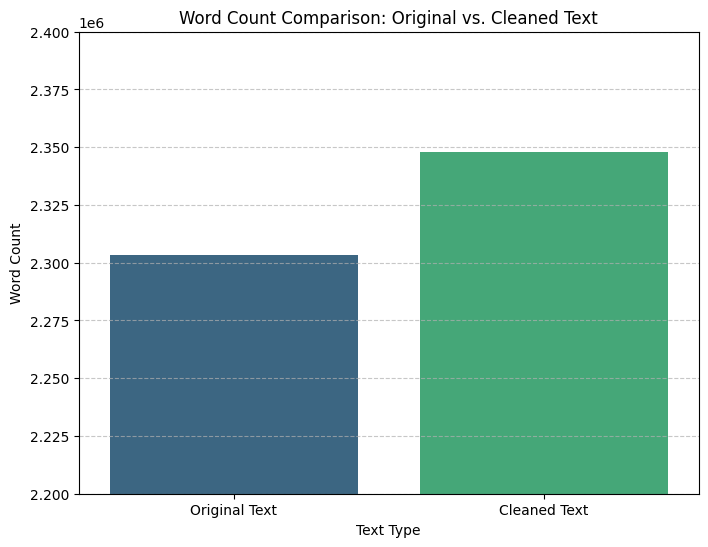
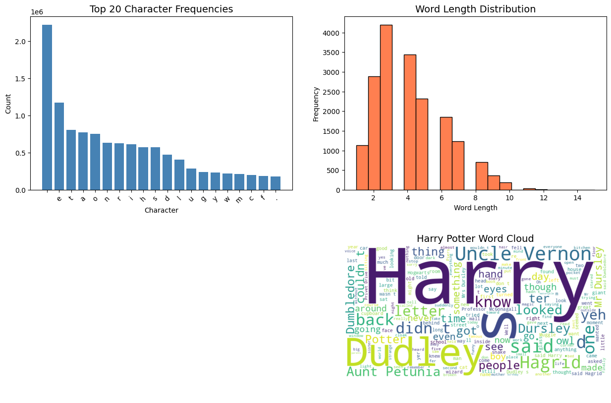
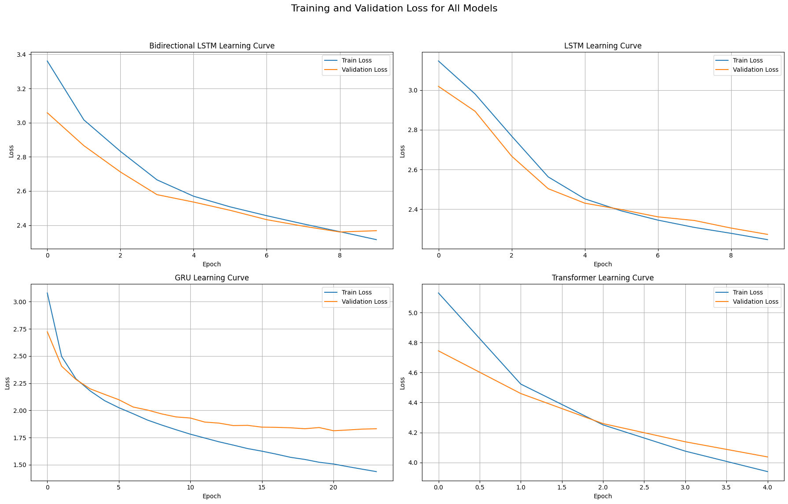
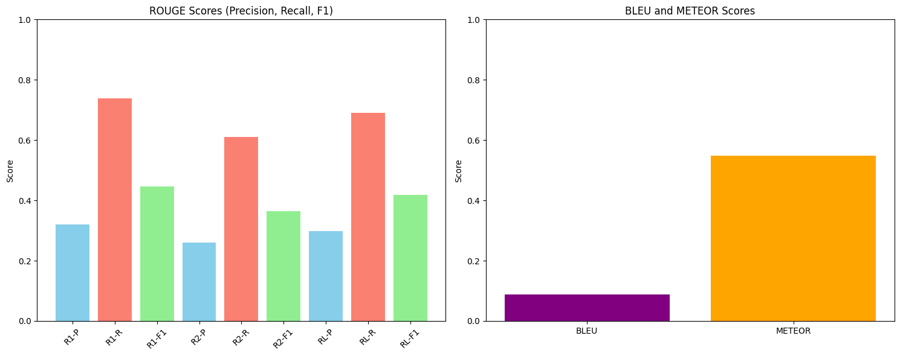

# nlp-proj-mzsl-hm

Ez a projekt egy nagyméretű szövegkorpuszon (Harry Potter) végzett szöveg-előkészítési, feltáró adatelemzési és neurális nyelvi modell kísérleteket mutat be.

## Projekt célja

- Szöveg tisztítása és statisztikai elemzése
- Karakter- és szóeloszlások vizsgálata
- Különböző szekvenciamodellek tanítása és összehasonlítása
- Automatikus szövegértékelési metrikák alkalmazása

## Szöveg-előkészítés

Az eredeti és a tisztított szöveg szóhosszát hasonlítjuk össze.

Megfigyelés:

- A tisztítás után a szótokenek száma nőtt
- A normalizálás javította a modell taníthatóságát

## Feltáró adatelemzés

Karaktergyakoriság, szóhossz-eloszlás és word cloud

**Megfigyelések:**
- A leggyakoribb karakterek megfelelnek az angol nyelv statisztikáinak
- A szavak többsége 3–6 karakter hosszú
- A word cloud kiemeli a történet fő szereplőit és fogalmait

## Tanított modellek

A következő neurális architektúrák kerültek kipróbálásra:

- LSTM
- Bidirectional LSTM
- GRU
- Transformer

## Értékelési metrikák

A modellek teljesítményét automatikus szövegértékelési metrikákkal mértük.

**Használt metrikák:**

- ROUGE-1 / ROUGE-2 / ROUGE-L (Precision, Recall, F1)
- BLEU
- METEOR

## Technológiák

- Python
- NumPy, Pandas
- Matplotlib
- TensorFlow / Keras
- NLTK

